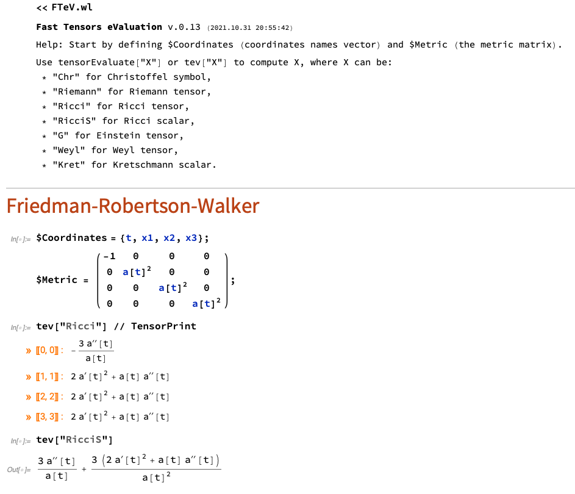
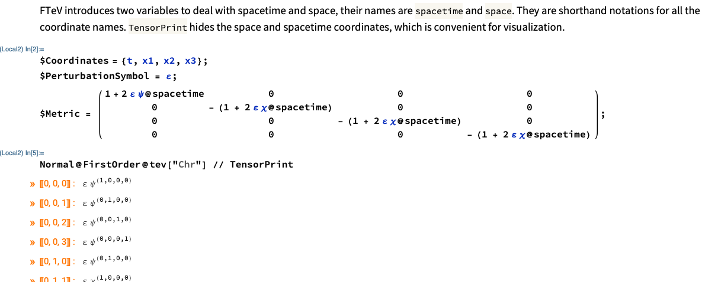

[](https://zenodo.org/badge/latestdoi/422944259)


# Fast Tensor eValuation (FTeV)

FTeV is a simple an useful Mathematica Package for defining and computing tensors from a given coordinate basis. Emphasis is given to the tensors used in General Relativity and other theories of gravity. Convenient functions for printig out the results and for computing metric perturbations are included.

## Example 1: Cosmological background



## Example 2: Perturbations



## Instalation
To install, copy and execute the following line inside Mathematica:
```
PacletInstall["https://github.com/davi-rodrigues/FTeV/raw/main/FTeV-0.13.2.paclet"]
```

Other FTeV versions can be easily installed changing properly the last number.

An output with a `PacletObject` should appear immediately. 

After the instalation, to call the package just execute the following in Mathematica
```
<< FTeV`
```

A usage example notebook is provided (`Simple example for perturbations within GR and BD.nb`).

## Thanks

FTeV belongs to a scientific project that is partially funded by CNPq (Brazil) and FAPES (Brazil).
